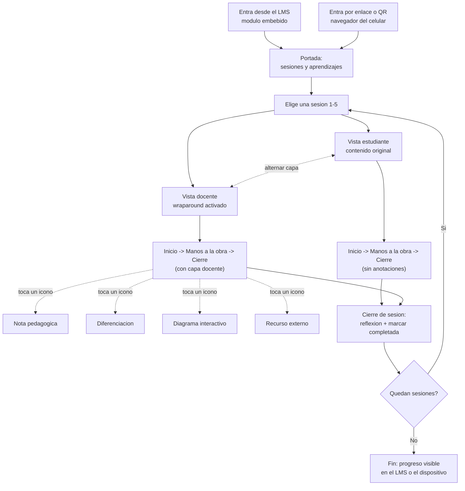

# Decisiones de producto: el explorador wraparound

Este documento versiona lo mismo que el [artifact de decisiones](https://claude.ai/artifact/J4Z9HYCKmauiK1NEH2TAqb): el recorrido de la persona docente por una sesión, y las seis decisiones clave que se acordaron antes de comparar plataformas.

## El recorrido de quien enseña

La persona docente entra desde el LMS o desde un enlace/QR en el celular, llega a la portada de la guía, elige sesión, y puede alternar en cualquier momento entre la vista del estudiante y la vista docente. Solo la vista docente expone los cuatro tipos de interacción (nota, diferenciación, diagrama animado, recurso externo) antes de cerrar la sesión y continuar.

## Referentes de formato

- **Code.org, Lesson 9** ("How AI Uses Data"): barra lateral con objetivos/estándares/vocabulario + guía de enseñanza cronometrada ("Do This", "Discuss"), cajas de "Assessment Opportunity" y "Teaching Tip".
- ***Writing with Power* — Teacher Wraparound Edition** (Perfection Learning): el más fuerte de los dos. Columna central angosta con el texto del estudiante; columnas izquierda y derecha con notas docentes agrupadas por sección (Pre-Assess, Critical Thinking, Speaking and Listening, Differentiated Instruction por nivel de ELL); cajas de anotación ancladas por **flecha a un párrafo específico** del texto del estudiante (no solo a la página); páginas de "Planning Guide" con tabla de estándares, tiempo sugerido y recursos por capítulo.
- ***Our Choice*** (Al Gore / Push Pop Press): referente de profundidad de interactividad en infografías dentro de un libro digital.

## Decisiones clave

### A. Experiencia en el aula

**Decisión 1 — ¿Dónde vive la capa docente frente al contenido original?**
- Superposición activable: se muestra u oculta con un toque.
- Wraparound fijo con anclaje por párrafo: márgenes siempre visibles a los lados del contenido, con flechas que apuntan a un párrafo o elemento específico — el patrón real de *Writing with Power*.
- Panel sincronizado: contenido y notas lado a lado, sin anclaje visual directo.

*Punto de partida:* wraparound fijo con anclaje por párrafo en pantallas anchas (proyector/escritorio, donde cabe el margen a ambos lados), y superposición activable en celular, donde el espacio no alcanza para las dos columnas de margen a la vez. El anclaje por párrafo (no solo por página) es lo que distingue un wraparound real de un simple panel de comentarios.

**Decisión 2 — ¿Qué tan profunda es la interactividad?**
- Texto emergente: comentarios y tips en un popover.
- Diagramas explorables: el diagrama de flujo se anima paso a paso al tocarlo.
- Simulación embebida: el editor de MakeCode funcionando dentro de la página, al estilo *Our Choice*.

*Punto de partida:* para el piloto de Guía 1, texto emergente + diagramas explorables. La simulación embebida queda como fase 2, dado el costo de integrar MakeCode en vivo.

**Decisión 3 — ¿Cuál es la unidad mínima que se navega?**
- Página del PDF tal como está impresa.
- Sesión completa (5 por guía).
- Momento de la sesión: Inicio / Manos a la obra / Cierre.

*Punto de partida:* navegar por sesión, con el momento como sub-unidad de scroll. Los cortes de página del PDF impreso no siempre coinciden con una unidad pedagógica completa.

### B. Arquitectura y sostenibilidad

**Decisión 4 — ¿Cómo conviven el requisito de LMS y el de celular?**
- Una sola web responsiva, embebida por iframe en el LMS y publicada también en un enlace directo.
- Dos builds: paquete SCORM/xAPI para el LMS y una PWA aparte.
- Solo LMS, confiando en que su propio visor se adapte al navegador móvil.

*Punto de partida:* una sola aplicación web servida desde una URL propia; se embebe por iframe donde el LMS lo permita y se comparte por enlace o QR en el celular. Un solo código para mantener en las 79 guías de la colección.

**Decisión 5 — ¿Debe funcionar sin conexión?**
- Requiere conexión permanente.
- Offline tras la primera carga (service worker).
- Versión ligera solo texto para conexiones muy limitadas.

*Punto de partida:* la propia Guía 0 contempla sedes sin conectividad o sin electricidad — diseñar para que funcione offline tras la primera carga es un requisito desde el día uno, no una optimización posterior.

**Decisión 6 — ¿Prototipo de una guía o plantilla para las 79?**
- Artesanal: se codifica a mano solo para Guía 1, grado 6º.
- Motor + datos: las anotaciones viven separadas del contenido (un archivo por sesión) y un mismo motor las renderiza sobre cualquier guía.

*Punto de partida:* construir el piloto ya sobre motor + datos. Es barato de hacer bien desde el inicio y muy costoso de corregir después, con 79 guías y más de 4.000 páginas en la colección completa.

## Próximo paso

Comparar plataformas, lenguajes y formatos concretos frente a estas seis decisiones: PDF enriquecido, web app a medida, herramientas de autoría (H5P, Genially), libro de texto digital, o un motor propio de mayor riqueza interactiva.
